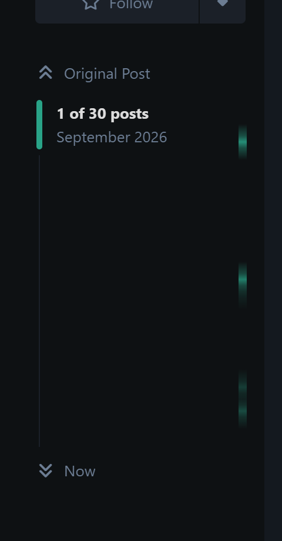

# Ridge

A long **Flarum 2** thread has a shape. A few posts get quoted, reacted to and
marked far more than the rest — and nothing in the forum shows you where they
are. You scroll, and hope.

Ridge reads the signals the forum already holds and draws them as a strip of
shading down the post scrubber, so a 300-post thread tells you where its high
ground is before you get there.



Three bands, three places the thread actually turned: the budget everyone
quoted, the quote that settled the venue, and the post that booked it.

## What it reads

Nothing is curated, nobody votes, and no new content type exists.

| Signal | Weight | Why |
|---|---|---|
| Being quoted | **3** | The strongest ordinary signal a forum makes — it costs the quoter something and says *these words* mattered |
| Being marked | **2** | Nobody highlights a passage for someone else's benefit ([Marginalia](https://github.com/ernestdefoe/marginalia), public marks only) |
| Reactions | **1** | Cheap by design, so worth the least — `flarum/likes` and `fof/reactions` both count |
| Accepted answer | *floor* | Not scored against the rest: given a guaranteed peak, because a scrubber that buries the resolution of a 200-post thread has failed |

Every signal is optional. Ridge checks which tables exist and counts what it
finds, so it works on a forum with none of those extensions installed — there
is simply less to draw.

## Decisions worth knowing about

- **Shading, not markers.** [Threadmarks](https://discuss.flarum.org/d/39803)
  and friends put pins *on* the scrubber. A second extension adding pins to the
  same forty pixels would be a fight the reader loses, so Ridge paints the
  track instead and the two can be installed together.
- **A strip at the edge, not a wash behind the track.** Full-width shading put
  a gradient under the handle's own label, which is a legibility gamble in
  every theme its author cannot see.
- **Peaks are spread over their neighbours.** One post is a fraction of a pixel
  on a 400-post track; a band is something a reader can aim at, and "around
  here" is the honest claim anyway.
- **Short threads get nothing.** Under twelve posts (configurable) there is no
  shape worth drawing and the reader can see the whole scrubber already.

## Cost

One request per discussion per page load — four aggregate counts, grouped by
post. It is a route of its own rather than an attribute on the discussion
resource, because hanging it there would run those counts for every row of the
discussion list to draw nothing.

## Installation

```bash
composer require ernestdefoe/ridge
```

## Licence

MIT
